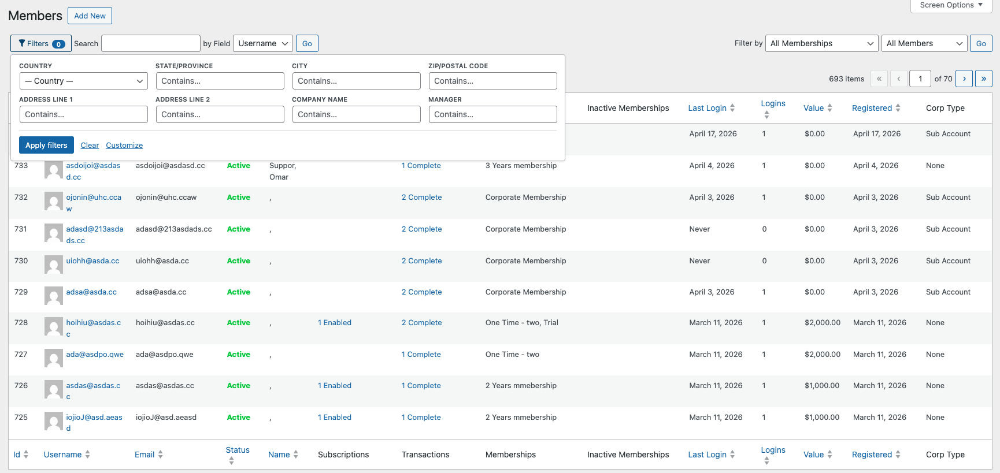

<div align="center">


# Admin Filters for MemberPress

**Filter the MemberPress Members admin list** by address and MemberPress custom fields (**Settings → Fields**), and optionally more fields you register in code — using MemberPress hooks only; no core files are modified.

[](https://github.com/omaraelhawary/admin-filters-for-memberpress/actions/workflows/phpunit.yml)


[](https://www.gnu.org/licenses/gpl-2.0.html)

[GitHub repository](https://github.com/omaraelhawary/admin-filters-for-memberpress) · [WordPress.org plugin](https://wordpress.org/plugins/admin-filters-for-memberpress/) · [MemberPress](https://memberpress.com/) (required; install separately — not on WordPress.org)

</div>

---

## At a glance

| | |
| --- | --- |
| **Contributors** | Omar ElHawary — [WordPress.org profile](https://profiles.wordpress.org/omarelhawary/) |
| **Requires** | WordPress 5.6+, PHP 8.1+, active [MemberPress](https://memberpress.com/) |
| **Current release** | 1.6.6 (see plugin header in `admin-filters-for-memberpress.php`) |
| **Text domain** | `admin-filters-for-memberpress` (matches the plugin slug) |
| **License** | GPLv2 or later |

The plugin lives in **`admin-filters-for-memberpress/`** with bootstrap **`admin-filters-for-memberpress.php`**. Custom translation files that used the old domain `memberpress-members-meta-filters` should be renamed to `admin-filters-for-memberpress-{locale}.mo`.

## Screenshots

Add or replace images under [`.github/readme-assets/`](.github/readme-assets/).

### Members list — floating Filters panel



## Features

- Filter the Members list by the six built-in MemberPress address fields: **Country**, **State / Province**, **City**, **Zip / Postal code**, and **Address lines 1 & 2**. Address filters appear when MemberPress has address capture enabled for **signup / checkout** (`show_address_fields`) **or** for the **account** page (`show_address_on_account`), unless you override with the `meprmf_include_address_filters` hook.
- Automatically expose every **MemberPress custom field** (MemberPress → Settings → Fields) as a filter:
  - `dropdown`, `radios` → single-choice (exact match)
  - `multiselect`, `checkboxes` → single-choice (substring match against the stored serialized value)
  - `checkbox` → checked / not set
  - `text`, `email`, `url`, `tel`, `date`, `textarea`, `file` → "contains" search
- **Members** list: floating **Filters** panel (customize which fields show; preferences in the browser via `localStorage`). The previous inline / collapsible toolbar is still available by filtering `meprmf_use_floating_members_panel` to false.
- Filtering is applied as `EXISTS` subqueries on `wp_usermeta` via the `mepr_list_table_args` filter, scoped to the `u` alias used by `MeprUser::list_table()`.
- With `WP_DEBUG` enabled, predicate SQL fragments can be echoed at the bottom of the Members screen for administrators (see `includes/ui/class-meprmf-debug-panel.php`).

## Installation

1. Copy the `admin-filters-for-memberpress` folder into `wp-content/plugins/` (or clone the repo into that path).
2. Activate **Admin Filters for MemberPress** from the Plugins screen.
3. MemberPress must already be active; the plugin does nothing if `MeprUtils` or `MeprOptions` are missing.

### Upgrading from `memberpress-members-meta-filters`

If you previously used the old directory name `memberpress-members-meta-filters/` and `memberpress-members-meta-filters.php`, deactivate the plugin, remove the old folder, upload or clone this plugin as `admin-filters-for-memberpress/`, then activate again. MemberPress **Settings → Fields** and address settings live in MemberPress; any extra filters you added with the `meprmf_members_meta_filters_fields` filter in your theme or a small plugin are unchanged.

## Usage

### Built-in and custom-field filters

Open **MemberPress → Members**. Open the **Filters** control, set values in the panel, then click **Apply filters** (or press Enter in a text field). MemberPress **Go** still runs the native search / membership row; it does not read the plugin panel fields. To hide the floating panel and use the previous inline toolbar, add `add_filter( 'meprmf_use_floating_members_panel', '__return_false' );`.

## Extending with code

All filter definitions pass through the `meprmf_members_meta_filters_fields` filter, so you can add, remove, or reorder filters programmatically:

```php
add_filter( 'meprmf_members_meta_filters_fields', function ( $fields ) {
    $fields[] = [
        'param'    => 'mpf_ext_referrer',
        'meta_key' => 'signup_referrer',
        'label'    => __( 'Referrer', 'your-textdomain' ),
        'type'     => 'text',
        'match'    => 'like',
    ];
    return $fields;
} );
```

Each field supports:

- `param` — `[a-z0-9_]` only; also used as the `$_GET` key.
- `meta_key` — the `wp_usermeta.meta_key` to match.
- `label` — visible label.
- `type` — `country`, `text`, `select`, or `checkbox`.
- `options` — `value => label` map, required for `select`.
- `match` — `exact`, `like`, or `contains` (defaults: `exact` for country/select, `like` otherwise).

Other available hooks:

- `meprmf_compact_filters_threshold` (int, default `6`) — number of filters that triggers the compact collapsible layout.

## How it works

- `mepr_table_controls_search` — renders the filter controls inside the Members toolbar (`Meprmf_Toolbar_Renderer`).
- `mepr_list_table_args` — appends `EXISTS ( SELECT 1 FROM {$wpdb->usermeta} ... )` fragments (`Meprmf_Predicate_Builder`), scoped to `u.ID`.

The procedural API (`meprmf_*` functions) in `compat/legacy-functions.php` delegates to classes in `includes/` so existing snippets and `remove_action` calls keep working.

## Development

### Requirements

- PHP 8.1+
- [Composer](https://getcomposer.org/) (for PHPUnit)

### Unit tests

From the plugin directory:

```bash
composer install
vendor/bin/phpunit
```

Tests use `tests/bootstrap-unit.php` (no full WordPress test database required). They cover utilities, screen detection, MemberPress field mapping, and safe no-op behavior when `$_GET['page']` is not the Members screen (so migration-style queries that call `mepr_list_table_args` without a Members page are not altered).

### Continuous integration

GitHub Actions (`.github/workflows/phpunit.yml`) runs `composer install` and `vendor/bin/phpunit` on PHP 8.1–8.3.

### Release zip (end users / WordPress.org upload)

Run this from the **plugin root** — the directory that contains `admin-filters-for-memberpress.php` and the `scripts/` folder (not from `wp-content/plugins` unless you use the path below).

```bash
cd /path/to/admin-filters-for-memberpress
bash scripts/build-release.sh
```

(`bash` avoids needing `chmod +x`.) Writes `dist/admin-filters-for-memberpress-<version>.zip` (version from the main plugin header), excluding tests, Composer, CI, `docs/`, `wordpress-org-assets/`, and `scripts/`. Put WordPress.org icons/banners in **`wordpress-org-assets/`** (see that folder’s README), then copy them to SVN `assets/` when you publish the listing.

## Changelog

### 1.6.7

- **Plugin Check / PHPCS:** escape filter control attributes at output sites; document or scope ignores for dynamic SQL identifiers, MemberPress hook name, and internal field arrays that use a `meta_key` schema key (not `WP_Query` meta clauses).
- **`languages/`:** remove `.gitkeep` (hidden file in zip); add `languages/index.php` with `ABSPATH` guard.
- **i18n:** remove redundant `load_plugin_textdomain()` (WordPress.org + WP 4.6+ auto-load).
- **Admin `GET`:** inline PHPCS directives for read-only `$_GET` use when enqueuing assets and when reading filter params.

### 1.6.6

- **WordPress.org:** add root `readme.txt`, align text domain with plugin slug, explicit non-affiliation wording for MemberPress / Caseproof; remove invalid `Requires Plugins: memberpress` header (MemberPress is not a wordpress.org plugin slug).
- **`languages/`** directory tracked for translation drops.
- **WordPress.org review:** `Plugin URI` points to the [plugin directory listing](https://wordpress.org/plugins/admin-filters-for-memberpress/); `GitHub URI` and README badges use the public repository.
- **Prefix compliance:** the extension filter for custom field definitions was renamed from `mepr_members_meta_filters_fields` to `meprmf_members_meta_filters_fields`. Update any `add_filter( 'mepr_members_meta_filters_fields', … )` snippets to use the new hook name.

### Earlier releases

Full line-by-line history (1.6.5 through 1.3.0, upgrade notes, and older refactors) is kept in **[readme.txt](readme.txt)** so it stays aligned with the WordPress.org listing. Bump **Current release** in the table above when you ship a new version.

## License

GPL v2 or later. See [https://www.gnu.org/licenses/gpl-2.0.html](https://www.gnu.org/licenses/gpl-2.0.html).
