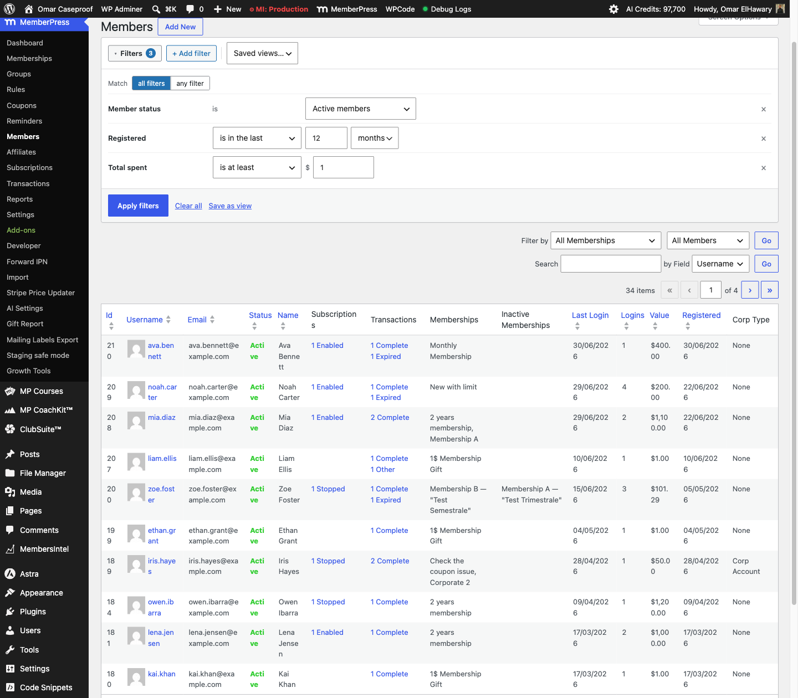

<div align="center">


# Admin Filters for MemberPress

**[View on WordPress.org →](https://wordpress.org/plugins/admin-filters-for-memberpress/)**

**Filter MemberPress admin lists** (Members, Subscriptions, Lifetimes, and Transactions) by address and MemberPress custom fields (**Settings → Fields**), and optionally more fields you register in code — using MemberPress hooks only; no core files are modified.

[](https://github.com/omaraelhawary/admin-filters-for-memberpress/actions/workflows/phpunit.yml)


[](https://www.gnu.org/licenses/gpl-2.0.html)

[GitHub repository](https://github.com/omaraelhawary/admin-filters-for-memberpress) · [WordPress.org plugin](https://wordpress.org/plugins/admin-filters-for-memberpress/) ([download latest .zip](https://downloads.wordpress.org/plugin/admin-filters-for-memberpress.latest-stable.zip)) · [MemberPress](https://memberpress.com/) (required; install separately — not on WordPress.org)

</div>

---

## At a glance

| | |
| --- | --- |
| **Contributors** | Omar ElHawary — [WordPress.org profile](https://profiles.wordpress.org/omarelhawary/) |
| **Requires** | WordPress 5.6+, PHP 8.1+, active [MemberPress](https://memberpress.com/) |
| **Current release** | 2.1.1 (see plugin header in `admin-filters-for-memberpress.php`) |
| **Text domain** | `admin-filters-for-memberpress` (matches the plugin slug) |
| **License** | GPLv2 or later |

This plugin is an **independent project**. It is not affiliated with, endorsed by, or sponsored by MemberPress.

The plugin lives in **`admin-filters-for-memberpress/`** with bootstrap **`admin-filters-for-memberpress.php`**.

## Screenshots

### Members list — Filters card



The same **Filters** card appears on **Transactions**, **Subscriptions (Recurring)**, and **Non-Recurring (Lifetimes)** with screen-appropriate fields (see table below).

## Features

- **Members, Subscriptions, Lifetimes, and Transactions** — address and **Settings → Fields** meta filters on every supported list, scoped to each list’s user column via `mepr_list_table_args`.
- **MemberPress table filters on every supported list** — membership (product), **Active / Inactive** access, subscription status, expires date range, and member-since date range. On **Members** (`mpm_*`), predicates use `EXISTS` on `mepr_transactions`, `mepr_subscriptions`, and `mepr_members`. On **Transactions** (`mpmt_*`), **Subscriptions** (`mpms_*`), and **Lifetimes** (`mpml_*`), the same controls apply to the list row (e.g. `tr.product_id`, `sub.status`, `expiring_txn.expires_at`).
- **Screen-specific filters in the panel** (in addition to MemberPress’s native toolbar): see [Filters by screen](#filters-by-screen). Native toolbar filters (`status`, `membership`, `gateway`, date presets) still work alongside the panel; all active conditions are combined (AND).
- Filter by the six built-in MemberPress address fields when address capture is enabled for signup/checkout and/or the account page (`meprmf_include_address_filters` to override).
- Automatically expose every **MemberPress custom field** (MemberPress → Settings → Fields) with control types mapped to exact, contains, or checkbox match behavior.
- **Query-builder Filters card** above the list on supported screens: one row per filter you add, each reading *field · comparison · value*, with **Match all filters / any filter**. Nothing is rendered until you add a filter, and the card's collapsed state is remembered in the browser (`localStorage`). Filter `meprmf_use_floating_meta_filters_panel` per screen; Members still respects `meprmf_use_floating_members_panel`.
- **Saved views** (filter card): name and reload common filter combinations on each list screen, **shared** with the other admins or **private** to whoever saved it, and optionally marked as the view a screen opens with. Views include plugin panel params **and** MemberPress native toolbar filters (`status`, `membership`, `gateway`, transaction date presets, gifting `type` when applicable). Any admin who can filter may save a private view; a shared one needs the capability set on the Settings screen.
- **Add-on aware passthrough filters** (when the add-on is active): **Course**, **Circle**, and **Directory** on **Members**; **Coupon** and **Gift type** on **Transactions** — these use the same GET params MemberPress add-ons already understand (`course`, `circle_id`, `directory`, `coupon_id`, `type`).
- **Members activity filters:** registered date range, last login range, total spent min/max, and **On trial** (`mepr_members` / user aggregates).
- **Corporate type** on **Members** when MemberPress Corporate is active (corp account owner, sub account, not corporate).
- **Coupon** on **Lifetimes** (`mpml_coupon`) via transaction row predicate.
- Meta filtering uses `EXISTS` subqueries on `wp_usermeta`, scoped to the list query’s user alias.
- With `WP_DEBUG` enabled, predicate SQL fragments can be echoed for administrators on supported list screens (`includes/ui/class-meprmf-debug-panel.php`).

## Installation

**From WordPress.org:** In wp-admin go to **Plugins → Add New**, search for **Admin Filters for MemberPress**, then install and activate. You can also use the listing’s **Download** button on [the plugin page](https://wordpress.org/plugins/admin-filters-for-memberpress/), or grab the [latest stable .zip](https://downloads.wordpress.org/plugin/admin-filters-for-memberpress.latest-stable.zip).

**Manual / from GitHub:**

1. Copy the `admin-filters-for-memberpress` folder into `wp-content/plugins/` (or clone the repo into that path).
2. Activate **Admin Filters for MemberPress** from the Plugins screen.
3. MemberPress must already be active; the plugin does nothing if `MeprUtils` or `MeprOptions` are missing.

## Usage

Open **MemberPress → Members** (or **Subscriptions**, **Lifetimes**, or **Transactions**). In the **Filters** card above the table:

1. Click **+ Add filter** and pick a field (type to search; fields are grouped by Membership, Dates, Activity, Content access, Location, Custom fields).
2. Each added row gives a comparison (*is*, *contains*, *is after*, *is between*, *is in the last*, *is empty*, …) and a value control for that field’s type.
3. Choose **Match all filters** (AND, default) or **any filter** (OR), then click **Apply filters**.
4. **×** removes one row; **Clear all** empties the card.

MemberPress **Go** still runs the native search; it does not read the card’s fields. For “who has active access on this plan?” style queries on **Members**, prefer **Access** and **Membership** in the card rather than mixing with MemberPress’s native **status** dropdown (they use different rules).

### Settings

**MemberPress → Admin Filters** holds four site-wide options, stored as one autoloaded array in `wp_options` (`meprmf_settings`):

| Option | Key | Default |
| --- | --- | --- |
| Which lists show filters | `enabled_screens` | all four page slugs |
| Filters card on / off | `floating_panel_enabled` | `true` |
| Custom date fields start as a from / to range | `date_range_default` | `true` |
| Capability needed to create a shared saved view | `shared_preset_capability` | `manage_options` |

A list you uncheck loses the filter card, the extra columns, and the predicates this plugin adds to its query, because `Meprmf_Screen_Context::supports_meta_filters_list()` is the one gate every site reads. Saved views for that list stay in `meprmf_filter_presets` and read back unchanged once the list is checked again. Turning the Filters card off removes the filter UI; it does not restore the inline toolbar used before 2.1.0.

### Saved views

1. Build a filter set and click **Save as view**, then enter a name and choose whether to keep the view private to you. Saving one of your own names again updates that view.
2. Pick a view from the **Saved views…** dropdown to apply it (same as bookmarking the filter URL). A private view is listed as `Name (private)`.
3. With a view selected, **Set as default** makes it the view that screen opens with for you; the button then offers **Clear default**, which is also how you can tell which view is your default.
4. When a screen has saved views, its first few appear as one-click pills in the card’s empty state.

Views are stored per screen (Members, Transactions, Subscriptions, Lifetimes) in `wp_options` (`meprmf_filter_presets`). They include plugin panel params (`mpf_*`, `mpm_*`, `mpmt_*`, `mpfs_*`, `mpml_*`) **and** native toolbar params for that screen (`status`, `membership`, `gateway`, transaction date fields, etc.).

Each row records its `owner` (a user id) and its `visibility` (`shared` or `private`). A **shared** view is offered to every admin who can filter that screen; a **private** view is returned only to its owner, filtered in `Meprmf_Presets::get_presets_for_screen()` so the `meprmf_filter_presets` payload never carries it either. Deleting or overwriting another admin's shared view is refused rather than silently applied — `manage_options` overrides that, filterable via `meprmf_can_manage_others_views`. Another admin's private view reads as not found, which does not confirm it exists.

A row saved before 2.2.0 has neither field, so it reads as shared and unowned: still usable and still deletable by anyone, with nothing rewritten in the database.

Creating a new **shared** view is checked against `shared_preset_capability` from the Settings screen (`manage_options` by default) in `Meprmf_Presets::save_preset()`, which returns the `not_allowed` code when the check fails. A **private** view needs no such capability, and updating a view you already own is not re-checked. `meprmf_can_manage_others_views` overrides the answer.

**Default view.** Each admin may mark one view per screen as the default, stored in user meta (`meprmf_default_view_<screen>`). Opening the screen with no filter param in the URL — ours or a native MemberPress one — redirects to that view's params plus `meprmf_view=<id>`, so the URL still says what the list is filtered by. An explicit filter in the URL always wins, and applying an empty filter set writes `meprmf_view=none` so a cleared list is not immediately re-filtered by the default it was cleared of. Deleting a view clears it as every admin's default, not only the deleter's.

### Filters by screen

| Filter | Members `mpm_*` | Transactions `mpmt_*` | Subscriptions `mpms_*` | Lifetimes `mpml_*` |
| --- | :---: | :---: | :---: | :---: |
| Membership | ✓ | ✓ | ✓ | ✓ |
| Access (active / inactive) | ✓ (user) | ✓ (row) | ✓ (row) | ✓ (row) |
| Subscription status | ✓ | ✓ (linked sub) | ✓ (`sub.status`) | ✓ (linked sub) |
| Expires from / to | ✓ | ✓ | ✓ | ✓ |
| Member since from / to | ✓ | ✓ | ✓ | ✓ |
| Member status (active / inactive / expired / non-members) | ✓ | — | — | — |
| Transaction status | — | ✓ | — | ✓ |
| Created from / to | — | ✓ | — | ✓ |
| Gateway | — | ✓ | ✓ | ✓ |
| Amount (`tr.total`) | — | ✓ | — | — |
| Subscription (`sub.subscr_id`) | — | ✓ | — | — |
| Transaction count (completed) | — | — | ✓ | — |
| Course / Circle / Directory (add-on) | ✓ | — | — | — |
| Corporate type (Corporate add-on) | ✓ | — | — | — |
| Registered / last login / spent / trial | ✓ | — | — | — |
| Coupon (`coupon_id` / `mpml_coupon`) | — | ✓ (`coupon_id`) | — | ✓ |
| Gift type (Gifting add-on) | — | ✓ | — | — |
| Address + custom fields (`mpf_*` / `mpfs_*` / `mpft_*`) | ✓ | ✓ | ✓ | ✓ |

**Access vs subscription status**

| Filter | What it shows |
| --- | --- |
| **Access → Active** | Members who currently have access to the selected membership (or any membership), based on **transactions** — same rules MemberPress uses for content access (`expires_at` in the future, or lifetime). |
| **Access → Inactive** | **Members:** who **used to** have access but **do not** now (user-level `EXISTS`). **Other lists:** label shows **(this row)** — the row’s transaction/subscription access period is expired, not the member’s overall access. |
| **Subscription status → Active / Pending** | Members with at least one **recurring subscription** row in that status (optionally for the selected membership). |
| **Cancelled subscription** | Members with at least one subscription marked **cancelled** in `mepr_subscriptions`. Billing has stopped; they may still have **Active** access until the paid period ends — use **Access** for that. |
| **Paused subscription** | Members with at least one subscription marked **suspended** in MemberPress (billing paused). Access depends on transactions; check **Access** if you need who can still view content today. |

| **Member status** (Members only) | Aligns with MemberPress **Filter by → status**: active, inactive, expired, or non-members (`mepr_members` aggregates). Optional **Membership** narrows active vs inactive membership lists the same way as core MemberPress. |

To remove the Filters card on Members (MemberPress’s own search and **Filter by … Go** rows stay, as do this plugin’s active-filter chips): `add_filter( 'meprmf_use_floating_members_panel', '__return_false' );`

## Extending with code

```php
add_filter( 'meprmf_members_meta_filters_fields', function ( $fields ) {
    $fields[] = [
        'param'    => 'mpf_ext_referrer',
        'meta_key' => 'signup_referrer',
        'label'    => __( 'Referrer', 'your-textdomain' ),
        'type'     => 'text',
        'match'    => 'like',
    ];
    return $fields;
} );
```

Each meta field supports `param`, `meta_key`, `label`, `type` (`country`, `text`, `select`, `checkbox`, `date`), optional `options`, and `match` (`exact`, `like`, `contains`).

**Param prefixes by screen** (use the native prefix in each hook callback):

| Screen | Hook | `param` prefix |
| --- | --- | --- |
| Members | `meprmf_members_meta_filters_fields` | `mpf_*` |
| Subscriptions / Lifetimes | `meprmf_subscriptions_meta_filters_fields` | `mpfs_*` |
| Transactions | `meprmf_transactions_meta_filters_fields` | `mpft_*` |

**Core table filter hooks** (fields need `param`, `label`, `type`, `source` of `mepr_transaction`, `mepr_subscription`, or `mepr_member`, plus optional `predicate` for built-in SQL):

| Screen | Hook | `param` prefix |
| --- | --- | --- |
| Members | `meprmf_members_core_filters_fields` | `mpm_*` |
| Transactions | `meprmf_transactions_core_filters_fields` | `mpmt_*` |
| Subscriptions | `meprmf_subscriptions_core_filters_fields` | `mpms_*` |
| Lifetimes | `meprmf_lifetimes_core_filters_fields` | `mpml_*` |

### Adding custom MemberPress-table predicates

Use `meprmf_mepr_predicate_fragments` to inject additional WHERE fragments after core-field predicates are built (any supported list screen):

```php
add_filter( 'meprmf_mepr_predicate_fragments', function ( $args, $ctx, $values, $valid ) {
    if ( ! $ctx->is_transactions() || empty( $values['mpmt_custom_thing'] ) ) {
        return $args;
    }
    global $wpdb;
    $args[] = $wpdb->prepare( 'tr.some_column = %s', $values['mpmt_custom_thing'] );
    return $args;
}, 10, 4 );
```

Pair this with the matching `meprmf_*_core_filters_fields` hook for that screen to register the UI field.

**Security:** Only append SQL you prepare yourself (`$wpdb->prepare()`). Do not concatenate raw request data into fragments.

**Settings screen precedence:** the four options under **MemberPress → Admin Filters** set the site-wide value, then the hooks and constants run. `meprmf_screen_filters_enabled` is applied last inside `supports_meta_filters_list()`, `meprmf_use_floating_members_panel` and `meprmf_use_floating_meta_filters_panel` are applied after `floating_panel_enabled` seeds their default, `MEPRMF_DATE_CUSTOM_FIELDS_USE_RANGE` and `meprmf_custom_date_fields_use_range` sit above `date_range_default`, and `meprmf_can_manage_others_views` sits above `shared_preset_capability`. So code that forces a value keeps it whatever is saved on the screen.

**Other hooks:** `meprmf_screen_filters_enabled`, `meprmf_use_floating_meta_filters_panel`, `meprmf_use_floating_members_panel`, `meprmf_include_address_filters`, `meprmf_field_catalog`, `meprmf_operator_labels`, `meprmf_filter_presets`, `meprmf_max_filter_presets_per_screen` (default `25`), `meprmf_use_inactive_access_predicate` (Members list inactive/expired access SQL; default `true`), `meprmf_members_addon_filters_fields`, `meprmf_members_activity_filters_fields`, `meprmf_native_toolbar_params`, `meprmf_corporate_type_predicate`.

### Performance notes

- **Inactive / expired access (Members):** uses `EXISTS` plus `NOT EXISTS` on `mepr_transactions` — two correlated subqueries per row. On large transaction tables this can slow the Members list. Return `false` from `meprmf_use_inactive_access_predicate` to skip that predicate, or avoid the filter on very large sites.
- **Custom field filters:** each active meta filter adds a correlated `EXISTS` on `wp_usermeta`. Many simultaneous custom-field filters increase query cost; date-range groups for one field are merged into a single `EXISTS`.
- **Debug SQL:** with `WP_DEBUG` on, predicate fragments print in the admin footer for administrators — keep `WP_DEBUG` off in production.

## How it works

- `mepr_table_controls_search` — renders filter controls (`Meprmf_Toolbar_Renderer`).
- `mepr_list_table_args` — appends meta `EXISTS` predicates (`Meprmf_Predicate_Builder`) and MemberPress table predicates (`Meprmf_Mepr_Predicate_Builder`: user `EXISTS` on Members, row-scoped on other lists). Predicates run only when the active `MeprDb::list_table()` caller matches the admin screen (Members / Transactions / Subscriptions / Lifetimes) and `WP_Screen` matches.

Procedural `meprmf_*` functions in `compat/legacy-functions.php` delegate to `includes/` classes.

## Development

### Requirements

- PHP 8.1+
- [Composer](https://getcomposer.org/) (PHPUnit)

### Unit tests

```bash
composer install
vendor/bin/phpunit
```

Uses `tests/bootstrap-unit.php` (no full WordPress test database). CI runs on PHP 8.1–8.3 via `.github/workflows/phpunit.yml`.

## Changelog

### 2.3.0

- **Settings screen** at **MemberPress → Admin Filters** (`Meprmf_Settings_Page`, submenu under `memberpress` at `admin_menu` priority 20, `manage_options`). One autoloaded array option, `meprmf_settings`, with `enabled_screens`, `floating_panel_enabled`, `date_range_default`, and `shared_preset_capability`. Accessors merge the stored value over `Meprmf_Settings::defaults()`, so a partial row keeps every other key.
- **Per-screen toggle** is read in `Meprmf_Screen_Context::supports_meta_filters_list()`, the single gate for the filter registry, columns, toolbar, native params, predicates, and presets. New hook `meprmf_screen_filters_enabled` runs after it.
- **Shared saved views** now need `shared_preset_capability` (`manage_options` by default) at creation time. `Meprmf_Presets::save_preset()` returns `not_allowed`. Private views and updates to a view you own are unaffected.
- `date_range_default` slots into the date-range precedence between the per-admin user meta and the built-in `true`.
- `uninstall.php` deletes `meprmf_settings`.
- **Bulk actions on the filtered set** (`wp_ajax_meprmf_bulk_set_meta`): writes one user meta key and value to every member the current filters match. `Meprmf_Bulk_Match_Set::fetch()` calls the same model method the screen's list table calls (`MeprUser::list_table`, `MeprTransaction::list_table`, `MeprSubscription::subscr_table`, `MeprSubscription::lifetime_subscr_table`) with `$paged` and `$perpage` empty, so `mepr_list_table_args` runs this plugin's predicates and `MeprDb::list_table` builds no LIMIT. Match count is the list-row count; writes are deduped to unique member ids first, and the confirmation reports both numbers.
- New capability `Meprmf_Capabilities::current_user_can_bulk_actions()`, defaulting to `manage_options` and filterable with `meprmf_bulk_actions_capability`. It gates the toolbar button, the script enqueue and the AJAX handler.
- Guards, in order: capability, `check_ajax_referer('meprmf_bulk_actions', 'nonce')`, `Meprmf_Bulk::precheck_request()` (screen, single-field search, `Meprmf_Presets::request_asks_for_filters()`), key and value validation, then the fetch, then `Meprmf_Bulk_Match_Set::has_active_predicates()`. That last check reads the builders' `get_last_fragments()`, which only hold anything after a real list-table call, so it has to come after the fetch.
- `Meprmf_Bulk_Set_Meta::validate()` refuses `wp_capabilities`, `wp_user_level`, `session_tokens`, their `get_blog_prefix()` forms, and the `mepr_`, `mepr-` and `meprmf_` prefixes. Matching ignores case, because `wp_usermeta.meta_key` carries a `_ci` collation and `WP_CAPABILITIES` would otherwise overwrite the `wp_capabilities` row. `meprmf_bulk_set_meta_blocked_keys` and `meprmf_bulk_set_meta_blocked_prefixes` extend both lists. Values run through `sanitize_text_field()`; arrays and objects are refused.
- `Meprmf_Bulk_Runner::run()` chunks the deduped id list (default 50, `meprmf_bulk_batch_size`) and returns `processed`, `succeeded`, `batches` and `failed_at`. It reads the stored value first, because `update_user_meta()` returns false for an unchanged value as well as for a failure, and stops at the first real failure.
- `Meprmf_Presets::request_filter_params()` is now public; the bulk guard reads the same param union the default-view check uses.

### 2.2.1

- **Perf:** `Meprmf_Presets::maybe_apply_default_view()` reads the admin's default view (one option, one user-meta read) before asking whether the request already carries a filter, which is what builds the whole normalized field registry via `request_filter_params()`. Measured on a 696-member site with the four screens' fields configured: one registry build and ~5 ms per clean list-screen load, down to zero builds and ~0.35 ms. Both are pure guards, so behaviour is unchanged.

### 2.2.0

- **Transactions: Amount** (`mpmt_amount_min` / `mpmt_amount_max` / `mpmt_amount__op`) on `tr.total`, in the site's MemberPress currency — `is at least`, `is at most`, `is between`.
- **Transactions: Subscription** (`mpmt_subscription`) on the gateway subscription id MemberPress shows in the Subscr. column (`sub.subscr_id`) — `contains`, `does not contain`, `is`, `is not`, `is empty`, `is not empty`. Every negative operator keeps one-off payments, whose `subscr_id` is NULL.
- **Subscriptions: Transaction count** (`mpms_txn_count_min` / `_max`) counting the row's **completed** transactions, the same definition MemberPress uses for its Transactions column.
- **Saved views have an owner and a visibility.** Shared or private; a private view is returned only to its owner. Deleting or overwriting another admin's shared view is refused (`meprmf_can_manage_others_views` overrides).
- **Default view per admin per screen.** A clean screen load applies it by redirect; an explicit filter URL wins; `meprmf_view=none` suppresses it so filters can be cleared.
- Pre-2.2.0 views read as shared and unowned. No migration runs and no stored row changes.
- Uninstall now also removes each screen's `meprmf_default_view_<screen>` user meta.

### 2.1.1

- Fixed: a native MemberPress toolbar filter left on its **All** option (All Memberships, All Statuses, All Gateways, the transaction date range's All) no longer produces an active-filter chip. `all` is MemberPress's no-restriction value, so the chip removed nothing.
- Screenshot and caption regenerated against the query-builder card.

### 2.1.0

- **Query-builder Filters card** on all four list screens: filters are added one at a time as a `field · comparison · value` row instead of a grid of every available field.
- **Comparisons per field type:** choice (`is`, `is not`, `is empty`), text (`contains`, `does not contain`, `is`, `is empty`), date (`is after`, `is before`, `is between`, `is in the last`, `is not in the last`), number (`is at least`, `is at most`, `is between`).
- **Match all or any** across the added filters.
- **Saved presets are now Saved views**, with unchanged site-wide storage and hooks.
- Active-filter chips use the same wording as the row that produced them, so `is` and `contains` no longer render identically.
- Filters remain plain query parameters, so filtered lists stay bookmarkable.

### 2.0.0

- **Saved filter presets** (floating panel): site-wide named presets on all four list screens; presets now include **native MemberPress toolbar** params (`status`, `membership`, `gateway`, transaction date fields, gifting `type`) in addition to plugin panel params.
- **Add-on passthrough filters:** Course, Circle, Directory (Members); Coupon and Gift type (Transactions) when the corresponding add-ons are active.
- **Members activity filters:** registered date range, last login range, total spent min/max, on trial.
- **Corporate type** filter on Members when MemberPress Corporate is active.
- **Coupon** filter on Lifetimes (`mpml_coupon`).
- Hooks: `meprmf_members_addon_filters_fields`, `meprmf_members_activity_filters_fields`, `meprmf_native_toolbar_params`, `meprmf_corporate_type_predicate`.
- **Floating panel:** Apply preserves active filters on hidden fields; badge reflects visible panel edits; focus trap while the panel is open.
- **Performance:** filter hook `meprmf_use_inactive_access_predicate` to skip the heaviest Members inactive-access predicate.
- **List-table scoping:** predicates still apply when `get_current_screen()` is unavailable (custom admin bootstraps).

### 1.9.1

- **Safer list-table scoping:** predicates apply only when `MeprDb::list_table()` is called from the matching MemberPress model method and `WP_Screen` matches (fail closed if the screen is unknown).
- **Members “Member since”** uses `EXISTS` on `mepr_members` (same pattern as other lists).
- **Transaction status** filter includes **Confirmed**.
- **Row-scoped Access** labels on Transactions, Subscriptions, and Lifetimes clarify “this row” semantics.
- **Date custom fields** (Settings → Fields): from/to range instead of a single exact date; per-admin toggle in the Filters panel customize UI (`meprmf_date_custom_fields_use_range`, default on). Filter `meprmf_custom_date_fields_use_range`; constant `MEPRMF_DATE_CUSTOM_FIELDS_USE_RANGE` for site-wide override.
- README: extension SQL security note; expanded Access documentation.

### 1.9.0

- **Core table filters on all four lists:** membership, access, subscription status, expires range, and member-since range on **Transactions**, **Subscriptions**, and **Lifetimes** (`mpmt_*`, `mpms_*`, `mpml_*`), with row-scoped SQL on each list’s primary table.
- **Screen-specific panel filters:** **Members** — member status (active / inactive / expired / non-members); **Transactions & Lifetimes** — transaction status, gateway, created date range; **Subscriptions & Lifetimes** — gateway (from `MeprOptions::payment_methods()`).
- Hooks `meprmf_transactions_core_filters_fields`, `meprmf_subscriptions_core_filters_fields`, and `meprmf_lifetimes_core_filters_fields` for extensions.
- `meprmf_mepr_predicate_fragments` applies on every supported list context, not only Members.
- README: per-screen filter matrix and updated extension docs.

### 1.8.0

- **Members list — MemberPress table filters:** filter by membership (product), active/inactive access (transactions), subscription status, expires date range, and member-since date range via `EXISTS` on `mepr_transactions`, `mepr_subscriptions`, and `mepr_members`.
- Hook `meprmf_members_core_filters_fields` and `meprmf_mepr_predicate_fragments` for extensions.
- Debug panel shows both meta and MemberPress table predicate fragments when `WP_DEBUG` is on.

### 1.7.0

- **Subscriptions, Lifetimes, and Transactions:** the same address and **Settings → Fields** meta filters as on **Members**, scoped to each list’s user column (`mepr_list_table_args`).
- **Floating Filters panel:** print panel markup in `admin_footer` on supported screens so MemberPress toolbar markup stays valid; filter `meprmf_use_floating_meta_filters_panel` to control the panel per screen (Members still respects `meprmf_use_floating_members_panel`).
- **Build:** minify floating-panel JS and toolbar CSS with esbuild when building the release zip (`npm run build` from `build-release.sh`).

### 1.6.8

- Floating Filters panel: when the set of filter query params changes (for example after enabling MemberPress **Show on Account** or **Show on Signup** for address), reset saved field visibility so new address filters are not left hidden by an older `localStorage` whitelist.
- Members provider: document address toggles explicitly; add a unit test for signup-only address capture.

### 1.6.7

- Improve escaping in Members filter controls (WordPress Plugin Check / PHPCS).
- Replace the languages directory placeholder with a non-hidden `index.php` so release zips avoid dotfiles flagged by Plugin Check.
- Drop redundant `load_plugin_textdomain()`; WordPress.org installs load translations automatically (WordPress 4.6+).
- Clarify read-only admin `GET` usage for script loading and filter query parameters where static analysis required it.
- Toolbar renderer: clearer attribute handling and inline documentation for SQL / predicate behavior; document WordPress.org banner/icon layout under `wordpress-org-assets/`.
- README (GitHub): structure and screenshot guidance refresh.

### 1.6.6

- WordPress.org packaging: add `readme.txt`, align the text domain with the plugin slug (`admin-filters-for-memberpress`), and clarify third-party / trademark disclaimer.
- Remove the `Requires Plugins: memberpress` header because MemberPress is not distributed from the wordpress.org plugin directory (dependency is documented here instead).
- Track a `languages/` directory for translation drops (initial placeholder before the 1.6.7 `index.php` layout).
- Release hygiene: tighten `.gitignore`, extend `scripts/build-release.sh`, and align `readme.txt` / README notes with the zip build and WordPress.org upload flow.
- WordPress.org review: set Plugin URI to the plugin directory listing; correct GitHub repository URL in plugin header and developer metadata (`composer.json` / README where applicable).
- Prefix compliance: rename the custom extension filter from `mepr_members_meta_filters_fields` to `meprmf_members_meta_filters_fields`. If you added filters in code, update your `add_filter` hook name.

### 1.6.5

- Floating **Filters** panel on **MemberPress → Members** (field visibility in the browser via `localStorage`; filter `meprmf_use_floating_members_panel` to use the previous inline toolbar).
- Address filters when MemberPress captures address on the **account** page only (not only at checkout).
- Refine filter control rendering for the floating panel.
- Style: toggle control layout and icon dimensions on the Members filters UI.
- README guidance for when to use extra user-meta filters vs MemberPress **Settings → Fields**; slightly smaller Members toolbar typography for alignment.

### 1.6.2

- Raise minimum PHP to **8.1** (was 7.4). WordPress **5.6+** requirement unchanged.
- Run PHPUnit / CI on PHP 8.1 through 8.3.
- Skipped semver labels: 1.6.3 and 1.6.4 were not published from this repository; the next version after 1.6.2 was 1.6.5.

### 1.6.1

- Rebrand and paths: plugin folder **`admin-filters-for-memberpress`**, main file **`admin-filters-for-memberpress.php`** (formerly *MemberPress Members Meta Filters* / `memberpress-members-meta-filters.php`).
- Refactor monolithic bootstrap into **`includes/`** classes with a compatibility layer in **`compat/legacy-functions.php`** so existing `meprmf_*` snippets keep working.
- Add **`uninstall.php`** for option cleanup on delete; remove redundant `register_uninstall_hook` usage.
- Add PHPUnit suite, `phpunit.xml.dist`, and GitHub Actions workflow.
- Consolidate filter field definition validation (duplicate `meta_key` rows, select rows missing choices, duplicate dropdown keys) and related helpers.

### 1.5.0

- Full MemberPress **address** filters: **state/province**, **zip/postal code**, and **address lines 1 & 2** (in addition to country and city).
- Filter hook **`meprmf_include_address_filters`** to control when built-in address filters are shown (default follows MemberPress address capture settings).
- Prefer MemberPress-configured address field labels when available.
- Plugin header: Author URI and GitHub repository URI.
- Pre-1.6.1 while the header still read 1.5.0 (monolithic `memberpress-members-meta-filters.php`): README sync — metadata and changelog match the shipped 1.4.0/1.5.0 feature set; document all six address filter fields.
- Uninstall: move option cleanup to `uninstall.php` and remove redundant `register_uninstall_hook` usage.
- Refactor: replace magic numbers with named constants; document maximum lengths enforced when validating filter `param` values.
- Refactor: extract `meprmf_normalize_filter_fields()` (and related helpers) for shared filter field validation.
- Merge `develop` (pull request #1): consolidate validation and handling for configured meta filters ahead of the rebrand.

### 1.4.0

- Declare **Requires at least: 5.6** and **Requires PHP: 7.4** in the plugin header.
- Guard plugin constants with `defined()` checks so they are not redefined.
- Load a text domain from the **`languages/`** directory.
- On uninstall, remove leftover plugin options when the plugin is deleted from wp-admin (`uninstall.php`).
- Stricter sanitization when normalizing filter field definitions: skip duplicate `meta_key` rows, require choices for select-type rows, and handle duplicate option keys in dropdown definitions.

### 1.3.0

- Initial release (as *MemberPress Members Meta Filters*): filters on the MemberPress **Members** admin list for **country**, **city**, and **MemberPress custom fields** (dropdown, radios, multiselect, checkboxes, checkbox, and text-style field types mapped to sensible controls).
- Apply list constraints via **`EXISTS`** subqueries on **`wp_usermeta`** through **`mepr_list_table_args`**, scoped to the Members list query.
- Compact collapsible filter layout when many filters are active (threshold filterable in later releases).

## Upgrade notices

### 2.1.1

Fixes an active-filter chip shown for a native MemberPress toolbar filter left on **All**, which restricted nothing. No other behaviour changes.

### 2.1.0

Redesigned Filters card: filters are added one at a time as field, comparison, and value. Bookmarked filter URLs and saved presets keep working. No database migration.

### 2.0.0

Major release: saved filter presets (including native toolbar params), add-on passthrough filters, Members activity filters, Corporate type, and Lifetimes coupon. The `knownParamsSignature` in localStorage may change — hard-refresh admin or reset **Customize** visibility if new fields do not appear.

### 1.9.1

Patch release: safer list-table scoping, custom date from/to ranges, Confirmed transaction status, and clearer row-scoped Access labels.

### 1.9.0

Feature release: core MemberPress table filters and screen-specific fields (member status, transaction status, gateway, created dates) on Transactions, Subscriptions, and Lifetimes as well as Members. No database migration; hard-refresh admin or clear **Customize** visibility if new fields do not appear.

### 1.8.0

Feature release: Members list filters for membership, access (active/inactive), subscription status, and date ranges on MemberPress tables. No database migration.

### 1.7.0

Feature release: filters on Subscriptions, Lifetimes, and Transactions admin lists in addition to Members. No database migration.

### 1.6.7

Maintenance release: output hardening, languages folder layout for WordPress.org checks, and translation loading alignment. No settings migration.

### 1.6.6

Text domain matches the plugin slug; rename custom MO/PO to `admin-filters-for-memberpress-*` if needed. If you used the old meta-filters hook, change it to `meprmf_members_meta_filters_fields`. Plugin URI and GitHub URI in the plugin header were updated.

### 1.6.5

Floating Filters panel and account-page address visibility. No database migration; clear browser storage only if you need to reset panel field visibility.

### 1.6.2

Requires PHP 8.1 or newer. Upgrade PHP before updating the plugin if you are still on 7.4.

### 1.6.1

Replaced folder `memberpress-members-meta-filters` with `admin-filters-for-memberpress`. Deactivate, remove the old folder, install the new path, activate. MemberPress settings unchanged. Old hook `mepr_members_meta_filters_fields` is now `meprmf_members_meta_filters_fields`.

### 1.5.0

Adds address filter query parameters (`mpf_state`, `mpf_zip`, etc.). Bookmarks or saved admin URLs from 1.4.0 still work for country/city; no migration required.

### 1.4.0

Declares WordPress 5.6+ and PHP 7.4+ in the plugin header. Ensure your host meets PHP 7.4 before updating from 1.3.0.

### 1.3.0

First install: no prior version. Requires MemberPress.

## License

GPL v2 or later. See [https://www.gnu.org/licenses/gpl-2.0.html](https://www.gnu.org/licenses/gpl-2.0.html).
